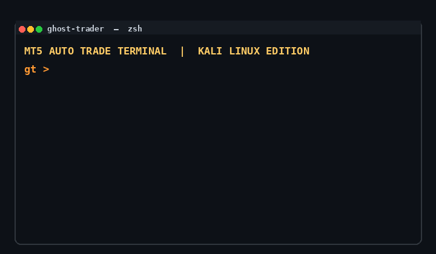
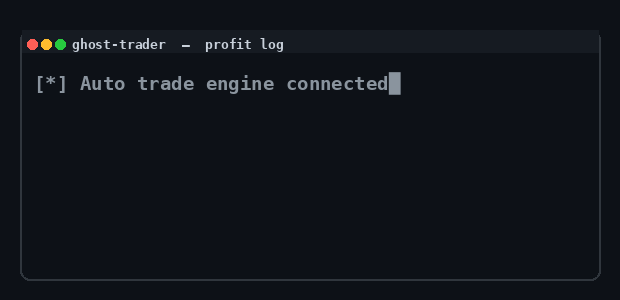

<p align="center">
  
</p>

<h1 align="center">🐍👻 GHOST TRADER 💰📈</h1>

<p align="center">
  <b>MT5 AUTO TRADE TERMINAL</b> — Kali Linux 🇮🇳 | Windows 💻
</p>

<p align="center">
  
  
  
  
  
  
</p>

<p align="center">
  🚀 <b>BUY / SELL / AUTO CLOSE</b> · 💵 <b>PROFIT TARGET</b> · 🔥 <b>MAX-LOSS PROTECTION</b><br/>
  🐧 <b>Kali Linux launcher</b> with animated GHOST TRADE intro · 🎯 one-click auto trading
</p>

---

## ✨ Intro - `ghost_trader.py`

Run karo aur **GHOST TRADE** ka saffron (kesari 🇮🇳) animated banner dekho — phir menu:

```text
┌──────────────────────────────────────────────┐
│            GHOST TRADE  -  MAIN MENU          │
├──────────────────────────────────────────────┤
│   [1]  Start Auto Trade     ▶ opens MT5 app   │
│   [2]  Go to Author Account ▶ opens my GitHub │
│   [3]  Exit                                   │
└──────────────────────────────────────────────┘
```

| Option | Action |
|--------|--------|
| **1 - Start Auto Trade** 🚀 | Opens the MT5 controller in a new window/tab |
| **2 - Go to Author Account** 👨‍💻 | Redirects to `github.com/technicalsuraj2` |
| **3 - Exit** 👋 | Close the tool |

## 💰 Earnings - what it does



- 🟢 **Connects** to the already-logged-in MetaTrader 5 terminal.
- 🎯 **Profit target** — auto-closes when combined profit is reached ✅
- 🛑 **Max-loss guard** — auto-closes before loss crosses your limit ⛔
- ⚡ **Manual BUY / SELL / Close-all** after enabling **Execute orders**.
- 🧊 Keeps your manual positions separate by default.

> 💸 Trading can lose money — start on a **demo account** with a small lot. No profit is guaranteed.

---

## 🐧 Install on Kali Linux

```bash
git clone https://github.com/technicalsuraj2/ghost-trader.git
cd ghost-trader
python3 -m venv .venv
source .venv/bin/activate
python -m pip install --upgrade pip
python -m pip install .
ghost-trader          # ▶ banner + menu
```

> 💡 The launcher **needs no dependencies** — banner, animation aur menu turant chalte hain.
> Real trading ke liye MT5 terminal + `MetaTrader5` module chahiye (Windows/Wine), kyunki
> official `MetaTrader5` pip wheel sirf **Windows** ke liye hai.

## 💻 Install on Windows

```powershell
python -m venv .venv
.\.venv\Scripts\Activate.ps1
python -m pip install -r requirements.txt
python mt5_control_app.py
```

---

## 🔰 Using it safely

1. Open MT5 and log into the correct broker account.
2. In Market Watch, confirm the broker's exact symbol name — e.g. `EURUSD`, `EURUSDm`, or `BTCUSD`.
3. Click **Use active MT5 session**, then **Preflight**.
4. Begin with a **demo account** and a small lot. Turn on **Execute orders** only when the displayed account and symbol are correct.

---

## 🛠 Tech Stack

| | |
|---|---|
| **Language** | 🐍 Python 3.10+ (100% Python) |
| **GUI** | 🖥 Tkinter / ttk |
| **Trading API** | 🔗 MetaTrader5 |
| **Platform** | 🐧 Kali Linux · 💻 Windows |

## 👨‍💻 Author

<p align="center">
  <b>Suraj Patel</b> — <a href="https://github.com/technicalsuraj2">@technicalsuraj2</a> 👈 follow karo 🔥<br/>
  💛 Star this repo ⭐ aur share karo spread the love 💖
</p>

## ⚠️ Disclaimer

This is a **local controller**, not investment advice. Trading involves risk — only trade money you can afford to lose.

## 📄 License

MIT License — see [LICENSE](LICENSE).